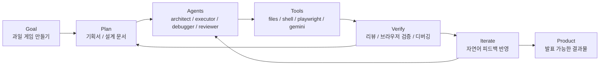
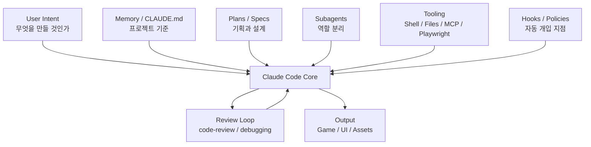
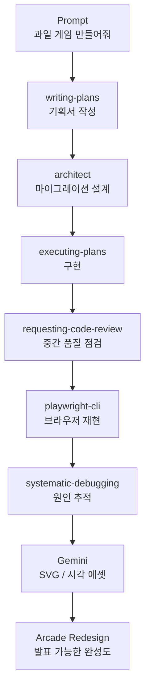

# Harness Engineering 시각화 초안

발표에서 `harness engineering`은 글보다 그림으로 설명하는 편이 훨씬 강합니다.
아래 3개 중 하나를 메인 도식으로 쓰는 구성이 좋습니다.

## 비주얼 A: 단선형이 아니라 루프형

메시지:
`Claude Code는 프롬프트 한 번으로 끝나는 도구가 아니라, 계획-실행-검증-반복 루프로 완성도를 올리는 시스템이다.`

좋은 점:
- `한 번에 만든다`가 아니라 `루프로 완성한다`는 메시지가 즉시 전달됩니다.

## 비주얼 B: 아케이드 기판 비유

메시지:
`Claude Code는 혼자 일한 것이 아니라, 잘 연결된 아케이드 기판처럼 여러 부품이 함께 작동했다.`

좋은 점:
- `모델 성능`이 아니라 `시스템 설계`가 핵심이라는 점을 보여주기 쉽습니다.
- 현재 레트로 게임 발표 톤과 가장 잘 맞습니다.

## 비주얼 C: 실제 프로젝트 매핑

메시지:
`이론이 아니라, 이 저장소에서 harness engineering이 실제로 어떻게 작동했는지`

좋은 점:
- 청중이 바로 `아, 이 사람은 실제로 이런 식으로 운용했구나`를 이해할 수 있습니다.

## 추천

가장 좋은 조합은 아래입니다.

1. 메인 개념 슬라이드에는 `비주얼 B`
2. 실제 사례 슬라이드에는 `비주얼 C`
3. 마지막 교훈 슬라이드에는 `비주얼 A`를 축약해서 재사용

## 디자인 메모

- 현재 발표가 레트로 아케이드 톤이므로, 도식도 `기판`, `배선`, `입출력 포트`, `진단 패널` 같은 메타포를 쓰는 편이 좋습니다.
- 네온 색은 3개만 씁니다.
  - 노랑: 목표 / 결과
  - 시안: Claude Code 핵심 제어부
  - 핑크: 검증 / 디버깅 루프
- 박스가 너무 많아지면 오히려 복잡해 보입니다.
  핵심은 `Claude Code 하나`보다 `주변 운영 레이어`가 중요하다는 인상을 주는 것입니다.
